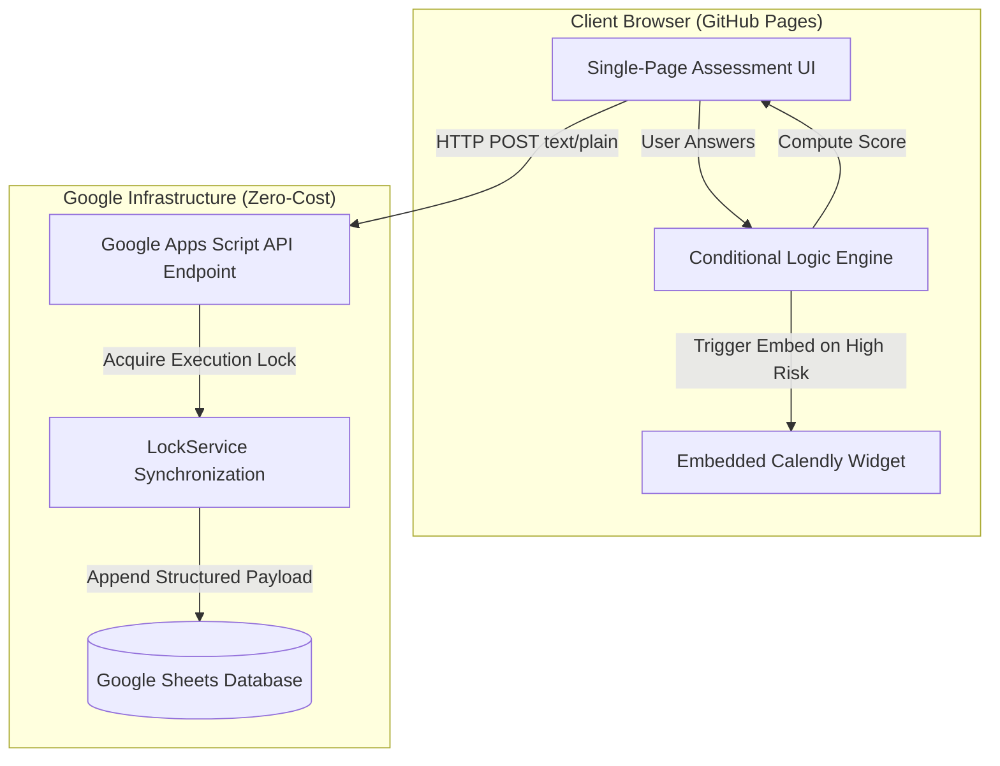

# Envestorr SecureCheck — Cybersecurity Diagnostic Tool

A zero-cost, serverless cybersecurity self-assessment web application designed to evaluate organizational security posture through an interactive diagnostic questionnaire. SecureCheck delivers real-time risk scoring, automated data ingestion into Google Sheets, and embedded consultation scheduling via Calendly—all running without persistent server infrastructure expenses.

---

## Architecture Overview

SecureCheck separates client-side diagnostic logic from backend persistence using static web hosting paired with serverless cloud scripts.

The architecture of Envestorr SecureCheck is designed as a decoupled, zero-cost serverless application that splits client-side interaction from backend data persistence. The front end operates entirely within the user's browser via static web hosting on GitHub Pages, executing a vanilla JavaScript conditional logic engine that calculates risk scores in real time based on user inputs across key cybersecurity domains. When a user completes the diagnostic, the front end package stringifies the payload and dispatches an asynchronous HTTP POST request directly to a serverless Google Apps Script API endpoint. To bypass browser Cross-Origin Resource Sharing (CORS) preflight restrictions inherent to Google Apps Script web apps, the payload is transmitted using a standard text/plain Content-Type header. Upon receipt, the backend script parses the raw text string into a JSON object, acquires a thread-safe execution lock using Google’s LockService API to prevent race conditions during concurrent submissions, and appends the structured assessment record directly to a central Google Sheets database. If the evaluated risk score exceeds a designated threshold, the client-side interface dynamically mounts an embedded Calendly widget, allowing high-risk organizations to immediately schedule a follow-up consultation.

## Core Features

* **Real-Time Risk Scoring**: Client-side JavaScript conditional engine processes multi-variable inputs across key security categories (MFA, passwords, backups, network hygiene) to generate immediate risk metrics.
* **Zero-Cost Serverless Backend**: Powered by Google Apps Script web endpoints, bypassing the need for paid API hosting or container infrastructure.
* **Thread-Safe Data Ingestion**: Uses Google Apps Script `LockService` API to prevent race conditions during concurrent submission writes to Google Sheets.
* **Integrated Scheduling Workflow**: High-risk diagnostic outputs dynamically render an embedded Calendly scheduling widget, encouraging immediate follow-up consultations.
* **CORS-Bypass Communication**: Standardizes client-to-backend payloads using `text/plain` headers, preventing Cross-Origin Resource Sharing (CORS) preflight blocks from browser security policies.

---

## Repository Structure

```
securecheck/
├── index.html              # Main single-page application & assessment interface
├── css/
│   └── styles.css          # UI layout and responsive design rules
├── js/
│   ├── app.js              # Diagnostic questionnaire controller
│   ├── logicEngine.js      # Risk score calculation & weighting rules
│   └── calendar.js         # Dynamic Calendly embed integration
├── backend/
│   └── Code.gs             # Google Apps Script web app endpoint & sheet handler
└── README.md               # Documentation

```

---

## Setup & Deployment Guide

### 1. Backend Setup (Google Apps Script)

1. Open [Google Sheets](https://sheets.google.com) and create a new spreadsheet named `SecureCheck_Responses`.
2. Set up column headers in Row 1: `Timestamp`, `Company Name`, `Email`, `Risk Score`, `Risk Level`, `Responses JSON`.
3. Open **Extensions > Apps Script** from the top menu.
4. Replace the default code with the contents of `backend/Code.gs`:

```javascript
function doPost(e) {
  var lock = LockService.getScriptLock();
  lock.tryLock(10000);
  
  try {
    var sheet = SpreadsheetApp.getActiveSpreadsheet().getActiveSheet();
    var data = JSON.parse(e.postData.contents);
    
    sheet.appendRow([
      new Date(),
      data.company,
      data.email,
      data.score,
      data.riskLevel,
      JSON.stringify(data.responses)
    ]);
    
    return ContentService
      .createTextOutput(JSON.stringify({ "result": "success" }))
      .setMimeType(ContentService.MimeType.JSON);
  } catch (error) {
    return ContentService
      .createTextOutput(JSON.stringify({ "result": "error", "error": error.toString() }))
      .setMimeType(ContentService.MimeType.JSON);
  } finally {
    lock.releaseLock();
  }
}

```

5. Click **Deploy > New Deployment**.
6. Select type: **Web app**.
7. Set **Execute as**: *Me*.
8. Set **Who has access**: *Anyone*.
9. Copy the generated **Web App URL**.

---

### 2. Frontend Configuration

1. Clone this repository:
```bash
git clone [https://github.com/dquayartey/securecheck.git](https://github.com/dquayartey/securecheck.git)
cd securecheck

```


2. Open `js/app.js` and set the `API_URL` variable to your Google Apps Script Web App URL:
```javascript
const API_URL = "[https://script.google.com/macros/s/YOUR_SCRIPT_ID/exec](https://script.google.com/macros/s/YOUR_SCRIPT_ID/exec)";

```


3. Update `js/calendar.js` with your Calendly booking link:
```javascript
const CALENDLY_URL = "[https://calendly.com/your-handle/security-review](https://calendly.com/your-handle/security-review)";

```


---

### 3. Deployment to GitHub Pages

1. Push your updates to your GitHub repository:
```bash
git add .
git commit -m "Configure API endpoints and booking links"
git push origin main

```


2. In GitHub, go to **Settings > Pages**.
3. Under **Build and deployment > Source**, select `Deploy from a branch`.
4. Set branch to `main` / `/ (root)` and click **Save**.

---

## Technical Considerations

* **CORS Preflight Prevention**: When submitting data to Google Apps Script, browsers block standard JSON preflight headers. Client POST requests are configured with `headers: { 'Content-Type': 'text/plain;charset=utf-8' }`, allowing the server to accept the raw payload and parse it internally with `JSON.parse()`.
* **Concurrency Handling**: Under simultaneous user submissions, Google Sheets can reject parallel writes. The script wraps row appending within `LockService.getScriptLock()`, enforcing sequential processing for up to 10 seconds per write attempt.

---

## License

Distributed under the Envestorr License. See `LICENSE` for details.

```

```
